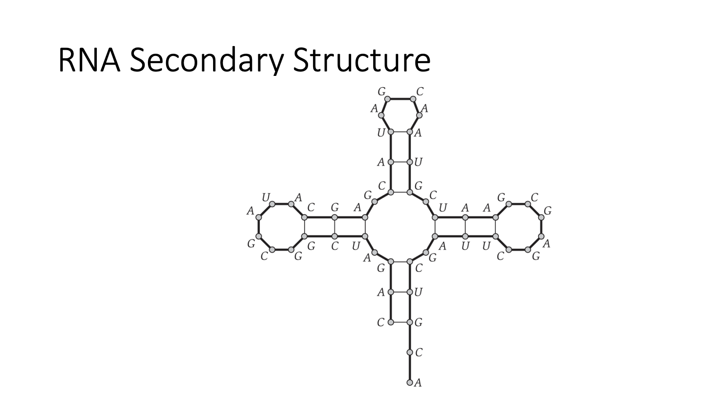
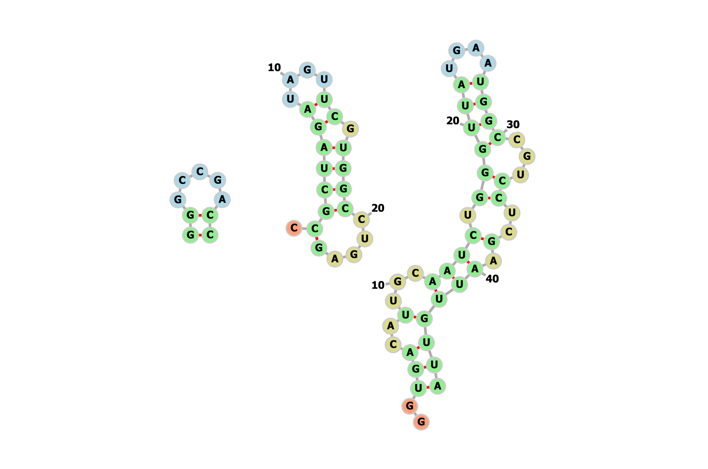

## **_RNA SECONDARY STRUCTURE_**
_This repository contains  a .py file for  prediction of  RNA secondary structure, knowing the RNA sequence._
***

 

### **_THEORITICAL BACKROUND_**
***
**_Example of Rna Secondary Sequence_**
<!-- *** -->

***

 

**_<ins>Secondary Structure Conditions:_**

1. _No sharp turns: if(i,j) in S,then i < j-4._
1. _{A,U} and {C,G} pairs_
1. _S is a matching : no base appears in more than one pairs_

1. _Non crossing condition: if (i,j) and (k,l) are two pairs in S, then we cannot have i<k<j<l._ 
 
 

**_<ins>Secondary Structure Algorithm:_**

>Initialize  _OPT(i,j)=0_ whenever i>=j-4
>
>for _k=5,6,....,n-1_
>> _for i=1,2,....,n-k_
>>> Set _j=i+k_
>>>
>>> Compute _OPT(i,j)_ using the recurrence in (6.13)
>>>
>>endfor
>>
>endfor
>
>return _OPT(1,n)_

 

> **(6.13)   &ensp; max(OPT(i,j-1),max(1 + OPT(i,t-1) + OPT(t+1,j-1))**

 
 

### **_FUNCTIONS_**
***
_Functions tha constitute the code are :_

1. - **can_pair**
 _Returns true if two bases can pair(condition 2)._

2.  - **get_dot_bracket_notation**
_Returns dot bracket notation of a secondary structure._

1. - **extract_pairs**
_Traceback and extract all pairs from final matrix._

1. - **get_opt_val**
_Returns optimum value for every cell of opt_val._

1. - **compute_rna_secondary_structure**
_Combines the other functions and returns rna secondary structure in dot bracket notation._

 
 

### **APPLICATION**
***

* _Have the following three (3) rna sequences:_

   1. &ensp; sequence = 'ACCGGUAGU'
   1. &ensp; sequence = 'AUGGCCAUUGUAAUGGGCCGCUGA'
   1. &ensp; sequence = 'ACGUCGAUUCGAGCGAAUCGUAACGAUACGAGCAUAGCGGCUAGAC'

 

* _The dot bracket notation of rna secondary structures is :_
    
    1. &ensp;'((.....))'
    1. &ensp;'.(((((((....)).))))....)'
    1. &ensp; '..(((..(...((((.((((((....))))...))..).)))))))'
***
 

*  _<ins>Visualiazation of secondary structures_ 

 

 

_<ins>References_
* Kleinberg & Tardos, Algorithm Design, Section 6.5 RNA Secondary
Structure: Dynamic Programming over Intervals
* Compeau & Pevzner, Bionformatics Algorithms
* https://en.wikipedia.org/wiki/Nucleic_acid_secondary_structure 

 

